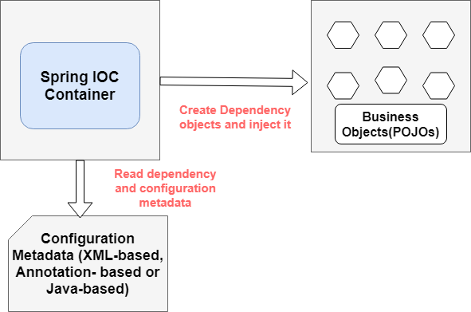

# Core Technologies

- [Back to Content](../../README.md)

In this notes, you will study :

- What is Spring IOC container
- How it works,
- How to create Spring IOC container,
- How to retrieve beans from Spring IOC container with examples.

## What We'll Learn?

- [What Is the Spring Container?](#the-spring-container)
- [What is Configuration Metadata?](#configuration-metadata)
- [How to Create a Spring Container?](#the-spring-container)
- [How to Retrieve Bean from Spring Container?](#retrieve-bean-from-spring-container)
- [Spring IOC Container XML Config Example](#spring-ioc-container-xml-config-example)
- [Spring IOC Container Java Config Example]()

---

## **The Ioc Container**

### **Introduction to the Spring IoC Container and Beans**

The Spring implementation of the Inversion of Control (IoC) principle.
`IoC` is also known as dependency injection (DI).

IOC is a process whereby objects define their dependencies  
The container then injects those dependencies when it creates the bean. only through :

1. constructor ,
2. setter
3. interface

The `org.springframework.beans` and `org.springframework.context` packages are the basis for Spring Framework’s IoC container.

`BeanFactory` is the root interface of Spring IOC container.

`ApplicationContext` is a sub-interface of BeanFactory.

It adds:

- Easier integration with Spring’s AOP features

- Message resource handling (for use in internationalization)

- Event publication

`WebApplicationContext` for use in web applications.

### In short:

- The `BeanFactory` provides the configuration framework and basic functionality.

- The ApplicationContext adds more enterprise-specific functionality.
  The ApplicationContext is a complete superset of the BeanFactory

### What are beans ?

In Spring, the objects that form the backbone of your application and that are managed by the Spring IoC container are called `beans`.  
`Beans`, and the `dependencies` among them, are reflected in the configuration metadata used by a container.

### What is a bean?

A `bean` is an object that is instantiated, assembled, and managed by a Spring IoC container.

---

## **The Spring Container**

The `ApplicationContext` interface represents the Spring IoC container and is responsible for instantiating, configuring, and assembling the beans.

The container gets its instructions on what objects to instantiate, configure, and assemble by reading configuration metadata.

The configuration metadata is represented in XML, Java annotations, or Java code.

It lets you express the objects that compose your application and the rich interdependencies between those objects.

### The responsibilities of IOC container are:

- Instantiating the bean
- Wiring the beans together
- Configuring the beans
- Managing the bean’s entire life-cycle

### **Common ApplicationContext types:**

- `AnnotationConfigApplicationContext`
- `AnnotationConfigWebApplicationContext`
- `ClassPathXmlApplicationContext`
- `FileSystemXmlApplicationContext`
- `XmlWebApplicationContext`

The following diagram shows a high-level view of how Spring works.  
Your application classes are combined with configuration metadata so that, after the ApplicationContext is created and initialized, you have a fully configured and executable system or application.



---

## Configuration Metadata

The Spring IoC container consumes a form of configuration metadata.  
This configuration metadata represents how you, as an application developer, tell the Spring container to instantiate, configure, and assemble the objects in your application.

### Three ways we can supply Configuration Metadata to Spring IoC container:

- XML-based configuration
- Annotation-based configuration
- Java-based configuration

---

## **How to Create a Spring Container**

Spring provides many ApplicationContext interface implementations that we use are;

`AnnotationConfigApplicationContext`:

- Using Spring in standalone Java applications and using annotations for Configuration, then we can use this to initialize the container and get the bean objects.

`ClassPathXmlApplicationContext`:

- If we have spring bean configuration XML file in a standalone application, then we can use this class to load the file and get the container object.

`FileSystemXmlApplicationContext`:

- This is similar to `ClassPathXmlApplicationContext` except that the XML configuration file can be loaded from anywhere in the file system.

`AnnotationConfigWebApplicationContext` and `XmlWebApplicationContext` for web applications.

### XML based Configuration

```java
ApplicationContext context = new ClassPathXmlApplicationContext("applicationContext.xml");
```

### Annotation Based Configuration

```java
@Configuration
class ApplicationConfiguration{}

AnnotationConfigApplicationContext  context = new AnnotationConfigApplicationContext(ApplicationConfiguration.class);
```

---

## Retrieve Bean from Spring Container

By using the method `T getBean(String name, Class<T> requiredType)`, you can retrieve instances of your beans.

### `ApplicationContext` getBean() Example:

```java
ApplicationContext context = new ClassPathXmlApplicationContext("applicationContext.xml");
HelloWorld obj = (HelloWorld) context.getBean("helloWorld");
```

---

## **Spring IOC Container XML Config Example**

### Spring Application Development Steps

Follow these three steps to develop a spring application:

- Create a simple Maven Project
- Add Maven Dependencies
- Configure HellowWorld Spring Beans
- Create a Spring Container
- Retrieve Beans from Spring Container

### Create a simple maven project using your favorite IDE

### Add Maven Dependencies

```xml
<dependencies>
    <dependency>
        <groupId>org.springframework</groupId>
        <artifactId>spring-context</artifactId>
    </dependency
    <dependency>
        <groupId>junit</groupId>
        <artifactId>junit</artifactId>
    </dependency>
    <dependency>
        <groupId>org.mockito</groupId>
        <artifactId>mockito-core</artifactId>
    </dependency>
</dependencies>
```

### Configure HelloWorld Spring Beans

```java
public class HelloWorld {
  private String message;
  public void setMessage(String message) {
      this.message = message;
  }
  public void getMessage() {
      System.out.println("My Message : " + message);
  }
}
```

### Configuration Metadata

```xml
 <bean id="helloWorld" class="com.isaachome.HelloWorld">
    <property name="message" value="Hello World!" />
 </bean>
```

###  Create a Spring Container

Use ClassPathXmlApplicationContext class to load the file and get the container object.
```java
ApplicationContext context = new ClassPathXmlApplicationContext("applicationContext.xml");
  
```

### Retrieve Beans from Spring Container


```java
 HelloWorld obj = (HelloWorld) context.getBean("helloWorld");
  obj.getMessage();
```