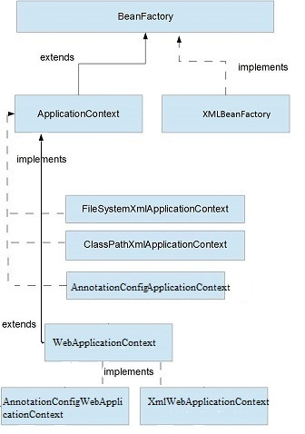

## **What is ApplicationContext Interface?**

The `ApplicationContext` is the central interface within a Spring application for providing configuration information to the application. 

The interfaces `BeanFactory` and `ApplicationContext` represent the Spring IoC container.   
`BeanFactory` is the root interface for accessing the Spring container. It provides basic functionalities for managing beans.

The `ApplicationContext` is a sub-interface of the BeanFactory.It offers all the functionalities of `BeanFactory`. Furthermore, it provides more enterprise-specific functionalities. 

The important features of ApplicationContext are :
- resolving messages
- supporting internationalization,
- publishing events
- application-layer-specific contexts
- This is why we use ApplicationContext as the default Spring container.


---

## **ApplicationContext Interface Implementation Classes**

The implementations of BeanFactory and ApplicationContext interfaces:




### **1. FileSystemXMLApplicationContext**

Use `FileSystemXMLApplicationContext` class to load an XML-based Spring configuration file from the file system or from URLs. 
```java
String path = "C:/Spring-demo/src/main/resources/spring-servlet.xml";

ApplicationContext appContext = new FileSystemXmlApplicationContext(path);
AccountService accountService = appContext.getBean("studentService", StudentService.class);
```

### **2. ClassPathXmlApplicationContext**

load an XML configuration file from the classpath, we can use the `ClassPathXmlApplicationContext` class. 

```java
ApplicationContext context = new ClassPathXmlApplicationContext("myconfig.xml");
```

Loading configuration from multiple files under classpath.

```java
ApplicationContext context = new ClassPathXmlApplicationContext(
newString[]{"servicesconfig.xml","daoconfig.xml"});
```

### **3. XmlWebApplicationContext**

If we use the XML-based configuration in a web application, we can use the `XmlWebApplicationContext` class.

Configuration classes declared and typically loaded from XML file in `/WEB-INF/`


```java
public class MyXmlWebApplicationInitializer implements WebApplicationInitializer {

  public void onStartup(ServletContext container) throws ServletException {
    XmlWebApplicationContext context = new XmlWebApplicationContext();
    context.setConfigLocation("/WEB-INF/spring/applicationContext.xml");

    context.setServletContext(container);

    // Servlet configuration
  }
}
```

### **4. AnnotationConfigApplicationContext**

The `AnnotationConfigApplicationContext` class was introduced in Spring 3.0.   
It can take classes annotated with @Configuration, @Component, and JSR-330 metadata as input.


Example:   
`AnnotationConfigApplicationContext` container with our Java-based configuration:

```java
@Configuration
public class StudentConfig{}
```
```java
ApplicationContext context = new AnnotationConfigApplicationContext(StudentConfig.class);
AccountService accountService = context.getBean(StudentService.class);
```


### **5. AnnotationConfigWebApplicationContext**

The `AnnotationConfigWebApplicationContext` is a web-based variant of `AnnotationConfigApplicationContext`.  

When we configure Spring's ContextLoaderListener servlet listener or a Spring MVC DispatcherServlet is in a web.xml file we may use this class.   


From Spring 3.0 onward, we can also configure this application context container programmatically.  
All we need to do is implement the `WebApplicationInitializer` interface:

```java
public class MyWebApplicationInitializer implements WebApplicationInitializer {

  public void onStartup(ServletContext container) throws ServletException {
    AnnotationConfigWebApplicationContext context = new AnnotationConfigWebApplicationContext();
    context.register(StudentConfig.class);
    context.setServletContext(container);
  }
}
```