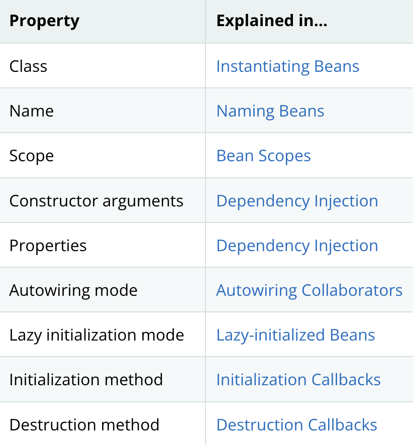

# **Spring Beans**

### Table of Content

- [Bean Overview](#bean-overview)
- [Naming Bean](#naming-beans)
- [Bean Naming Conventions](#bean-naming-conventions)
- [Instantiating Beans]

---
## **Bean Overview**

A Spring IoC container manages one or more beans. These beans are created with the configuration metadata that you supply to the container.

Within the container itself, these bean definitions are represented as `BeanDefinition` objects, which contain the following metadata:

- A package-qualified class name: typically, the actual implementation class of the bean being defined.

- Bean behavioral configuration elements, which state how the bean should behave in the container (scope, lifecycle callbacks, and so forth).

- References to other beans that are needed for the bean to do its work. These references are also called `collaborators` or `dependencies`.

- Other configuration settings to set in the newly created object — for example, the size limit of the pool or the number of connections to use in a bean that manages a connection pool.

This metadata translates to a set of properties that make up each bean definition. 


## The following table describes these properties:




---

## **Naming Beans**

Every bean has one or more identifiers.

These identifiers must be unique within the container that hosts the bean. A bean usually has only one identifier. 

However, if it requires more than one, the extra ones can be considered aliases.   


In XML-based configuration metadata:
- the `id` attribute, 
- the `name` attribute, or 
- both to specify the bean `identifiers`. 

 If you do not supply a `name` or `id` explicitly, the container generates a unique name for that bean.

---

## **Bean Naming Conventions**

Bean names start with a lowercase letter and are camel-cased from there.  
 
Examples of such names include `accountManager`, `accountService`, `userDao`, `loginController`, and so forth.

```xml
<bean id="accountService" class="com.isaachome.AccountService"/>
```

---

## **Instantiating Beans**


A `bean definition` is essentially for creating one or more objects. The container looks at the `bean definition` for a named bean when asked and uses the configuration metadata encapsulated by that bean definition to create  an actual object.  


In XML-based configuration metadata, you specify the type of object that is to be instantiated in the `class` attribute of the <bean/> element.

```xml
<bean id="accountService" class="com.foo.AccountService"/>
```

 This `class` attribute is usually mandatory.You can use the Class property in one of two ways:

 1. Instantiation with a Constructor

    The container itself directly creates the bean by calling its constructor reflectively, equivalent to Java code with the `new` operator.

    ```xml
    <bean id="exampleBean" class="examples.ExampleBean"/>

    <bean name="student" class="examples.Student"/>
    ```


 2. Instantiation with a Static Factory Method

    The container invokes a `static factory method` on a class to create the bean.

    ```xml
    <bean id="clientService"
        class="examples.ClientService"
        factory-method="createInstance"/>
    ```

    ```java
    public class ClientService {
        private static ClientService clientService = new ClientService();
        private ClientService() {}

        public static ClientService createInstance() {
            return clientService;
        }
    }
    ```